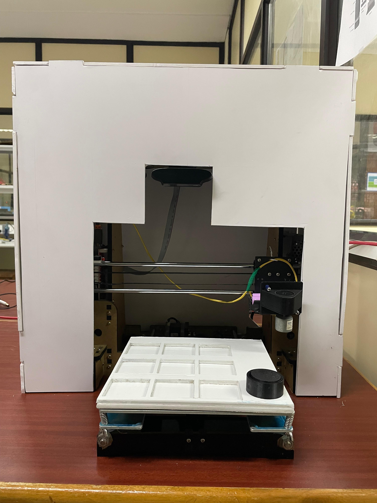
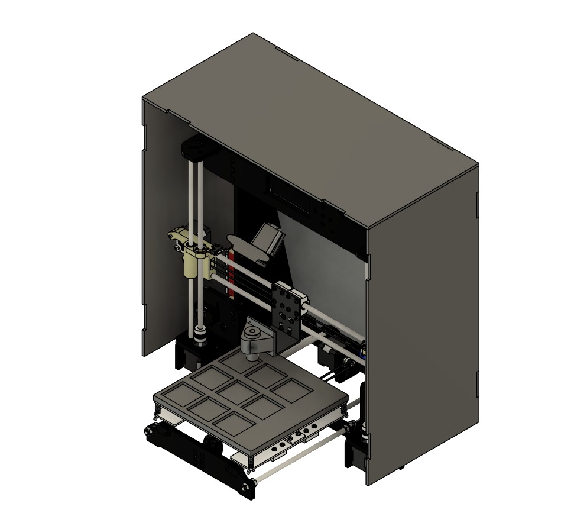

# 🤖 Vision-Based CNC Pick-and-Place Machine with Machine Learning

> A CNC pick-and-place machine enhanced with computer vision and machine learning — capable of autonomously detecting, classifying, and manipulating objects in real time using a Raspberry Pi, CNN-based object recognition, and G-code motion control.

**Anna University, College of Engineering Guindy | Nov 2023 – Feb 2024**

**Team:** Dhiraj Zen B K · Rishikesh Selvaraj Pillai · Nirenjan K · Ahilesh V

---

## 📸 Gallery

<p align="center">
  
  <br><em>Physical build — CNC machine with foam casing, overhead webcam mount, 3x3 game board, and electromagnet tool head</em>
</p>

<p align="center">
  
  <br><em>CAD model of the full system — showing the XY gantry, Z-axis, electromagnet tool head, and enclosure design</em>
</p>

---

## 📖 Overview

Traditional CNC machines are constrained to fixed, pre-programmed toolpaths — they cannot perceive or adapt to their environment. This project overcomes that limitation by integrating **computer vision** and **machine learning** into a CNC pick-and-place system, enabling the machine to autonomously detect objects, make intelligent decisions, and execute precise manipulation tasks.

The system was demonstrated through a fully autonomous **Tic-Tac-Toe playing robot** and extended to a **blood sample QR identification** use case, validating the approach for real-world flexible manufacturing automation.

---

## ✨ Key Features

- **99% picking accuracy** across three distinct object types in live demonstration
- **CNN-based real-time object classification** — scalable to 10+ object classes
- **Three computer vision pipelines** — Contour Detection, Canny Edge Detection, and Template Matching
- **Minimax AI algorithm** for autonomous game-playing decision making
- **Electromagnet tool head** for contactless pick-and-place of game pieces
- **Raspberry Pi 4** orchestrating vision, ML inference, and G-code generation
- **Dynamic toolpath generation** — G-code computed on-the-fly based on detected object positions
- **Foam sheet enclosure** with overhead webcam mount for controlled perception

---

## 🏗️ System Architecture

```
┌─────────────────────────────────────────────────────────┐
│                    Perception Layer                     │
│         Overhead Webcam → OpenCV Image Pipeline        │
│   (Contour Detection / Canny Edge / Template Matching) │
└──────────────────────────┬──────────────────────────────┘
                           │ Detected Object Positions
┌──────────────────────────▼──────────────────────────────┐
│                  Intelligence Layer                     │
│     CNN Object Classifier + Minimax Algorithm           │
│          (Raspberry Pi 4 — Python)                      │
└──────────────────────────┬──────────────────────────────┘
                           │ Decision + Target Coordinates
┌──────────────────────────▼──────────────────────────────┐
│                   Control Layer                         │
│     Dynamic G-code Generator → PySerial → CNC          │
│        (Multi-axis motion + electromagnet trigger)      │
└──────────────────────────┬──────────────────────────────┘
                           │ G-code Commands
┌──────────────────────────▼──────────────────────────────┐
│                  Actuation Layer                        │
│     CNC Gantry (XYZ) + Electromagnet Tool Head         │
│           (Pick, Move, Place game pieces)               │
└─────────────────────────────────────────────────────────┘
```

---

## 🔧 Hardware Components

| Component | Description |
|-----------|-------------|
| **Controller** | Raspberry Pi 4 |
| **CNC Platform** | 3-axis CNC gantry (X, Y, Z) |
| **Tool Head** | Custom 3D-printed electromagnet holder |
| **Gripper Mechanism** | Electromagnet (GPIO-controlled via Raspberry Pi) |
| **Vision Sensor** | USB webcam (overhead mounted) |
| **Game Board** | 3D-printed 3×3 grid base with spring-leveled platform |
| **Game Pieces** | Custom 3D-printed shapes (triangular & circular coins) |
| **Enclosure** | Foam sheet casing with camera aperture |
| **Motion Control** | G-code over serial (PySerial) |

---

## 💻 Software Stack

| Layer | Technology |
|-------|-----------|
| **Computer Vision** | OpenCV (Python) |
| **Machine Learning** | CNN (Convolutional Neural Network) |
| **Game AI** | Minimax Algorithm |
| **CNC Control** | G-code via PySerial |
| **Runtime Platform** | Raspberry Pi 4 (Python) |
| **CAD Design** | CAD software (enclosure + game pieces) |

---

## 🧠 Computer Vision Pipelines

Three independent object detection methods were developed and evaluated:

**Method 1 — Contour Detection**
- Converts frame to grayscale → binary threshold → contour extraction
- Identifies object boundaries and computes centroid positions
- Best for high-contrast, well-separated objects

**Method 2 — Canny Edge Detection**
- Applies Gaussian blur → Canny edge detector → contour analysis
- More robust to lighting variation
- Handles partial occlusion better than pure thresholding

**Method 3 — Template Matching**
- Uses reference images of each object class (circular coin, triangular coin)
- Slides template across frame to find best match region
- Highest accuracy for known, fixed object classes — achieved **99% picking accuracy**

---

## 🎮 Application 1 — Autonomous Tic-Tac-Toe

The primary demonstration application:

1. CNC machine initializes and homes to origin
2. Webcam captures the 3×3 game board state
3. Computer vision detects the human player's move position
4. **Minimax algorithm** computes the optimal counter-move
5. G-code is dynamically generated for the target cell coordinates
6. Electromagnet tool head picks the machine's game piece from the staging area
7. CNC moves to target cell and deactivates electromagnet to place the piece
8. Loop continues until game over

**Phase 1** used a pencil tool head to draw X/O on paper.
**Phase 2** upgraded to electromagnet pick-and-place with custom 3D-printed game pieces.

---

## 🩺 Application 2 — Blood Sample QR Identification

The system was extended beyond gaming to demonstrate industrial applicability:

- QR codes affixed to blood sample vials are detected and decoded by the vision pipeline
- Samples are autonomously sorted and placed into designated positions based on QR content
- Validates the ML-based approach for flexible manufacturing and lab automation

---

## 📐 Hardware Design & Fabrication

- **Game base** — 3D-printed 3×3 grid with recessed cells for precise piece placement
- **Electromagnet tool head** — custom CAD-designed holder integrating the electromagnet at the CNC tool mount; height and gripping force adjustable
- **Foam enclosure** — lightweight panels cut to CNC dimensions, assembled with adhesive; overhead camera aperture provides fixed, consistent view of workspace
- **Spring-leveled platform** — build plate mounted on spring screws for Z-axis leveling

---

## 📊 Results

| Metric | Result |
|--------|--------|
| Object picking accuracy | **99%** |
| Object classes demonstrated | 3 (circular coin, triangular coin, QR vials) |
| Object classes (scalable to) | **10+** |
| Game AI | Minimax (optimal play) |
| CV methods implemented | 3 (Contour, Canny, Template Matching) |
| Control platform | Raspberry Pi 4 |

---

## 🚀 Getting Started

### Requirements

```
Python 3.x
OpenCV (cv2)
PySerial
NumPy
TensorFlow / Keras (for CNN inference)
Raspberry Pi 4 (or any Linux system with serial access)
```

### Installation

```bash
git clone https://github.com/<your-username>/vision-cnc-pnp.git
cd vision-cnc-pnp
pip install -r requirements.txt
```

### Running the System

```python
# Connect CNC machine via USB serial
import serial
ser = serial.Serial('/dev/ttyUSB0', 115200)

# Run main pipeline
python main.py
```

The system will initialize the CNC, start the webcam feed, and begin the autonomous pick-and-place loop.

---

## 📁 Repository Structure

```
vision-cnc-pnp/
├── images/
│   ├── vision_based_pnp_cnc_robot.jpg
│   └── vision_based_pnp_cnc_robot_model.jpg
├── vision/
│   ├── contour_detection.py
│   ├── canny_edge_detection.py
│   └── template_matching.py
├── ml/
│   ├── cnn_classifier.py
│   └── minimax.py
├── control/
│   ├── gcode_generator.py
│   └── cnc_serial.py
├── hardware/
│   └── cad/                  # STL files for game pieces, tool head, board
├── main.py
├── requirements.txt
└── README.md
```

---

## 👥 Authors

**Ahilesh V** — Led computer vision development; implemented all three detection pipelines, CNN integration, and Raspberry Pi coordination

**Dhiraj Zen B K**, **Rishikesh Selvaraj Pillai**, **Nirenjan K** — Hardware design, fabrication, ML algorithm development, and system integration

*Bachelor of Engineering in Electronics and Communication Engineering*
*College of Engineering Guindy, Anna University — May 2024*

---

## 📄 License

This project is open source and available under the [MIT License](LICENSE).

---

*Submitted as final year undergraduate project, Anna University (2024)*
